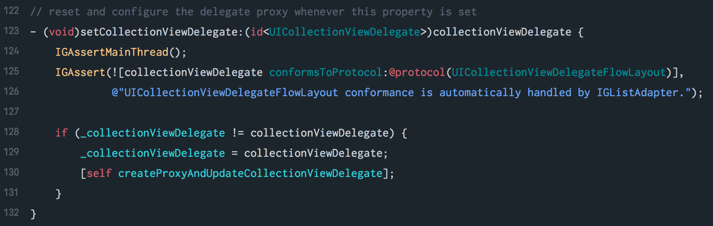
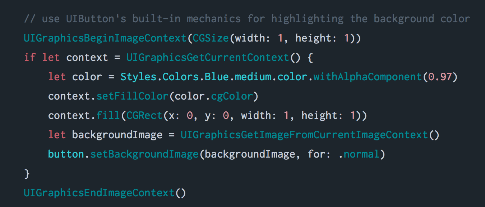

# Metro Lights theme for Xcode

Inspired by [City Lights for Atom](http://citylights.xyz/).

## Installation

```sh
$ git clone https://github.com/rnystrom/Metro-Lights-Xcode.git && \
cp Metro-Lights-Xcode/Metro\ Lights.xccolortheme \
~/Library/Developer/Xcode/UserData/FontAndColorThemes
```

## Fonts

I use [Inconsolata-g](http://leonardo-m.livejournal.com/77079.html) for everything. The theme is setup to use this font, but you can easily change it by highlighting all styles in Xcode > Preferences > Fonts & Colors > Metro Lights and changing the fonts (search for the "T").

## Screenshots

**Objective-C**



**Swift**


